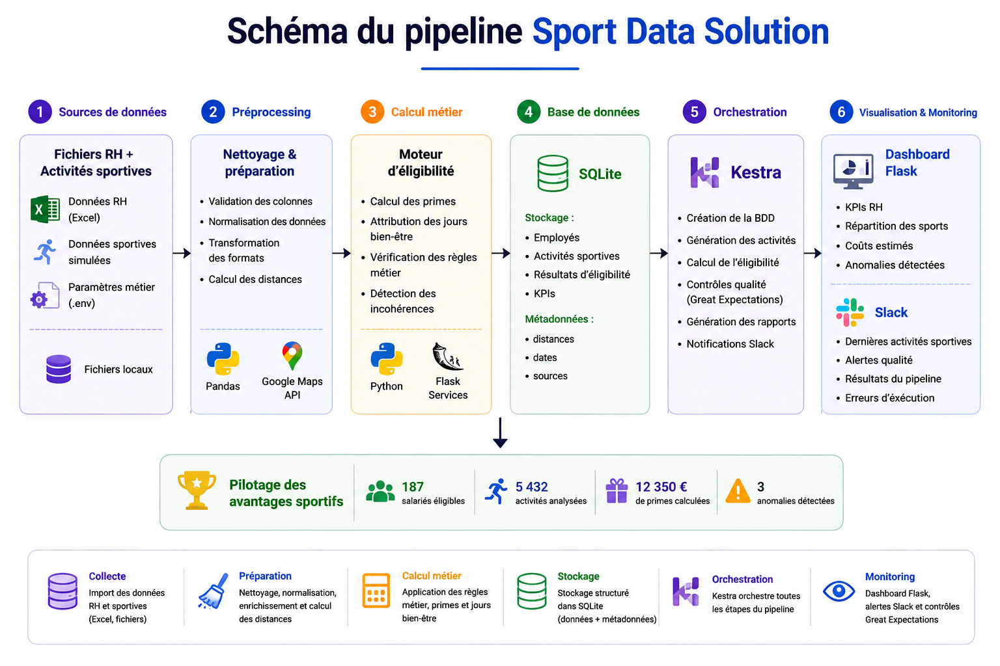
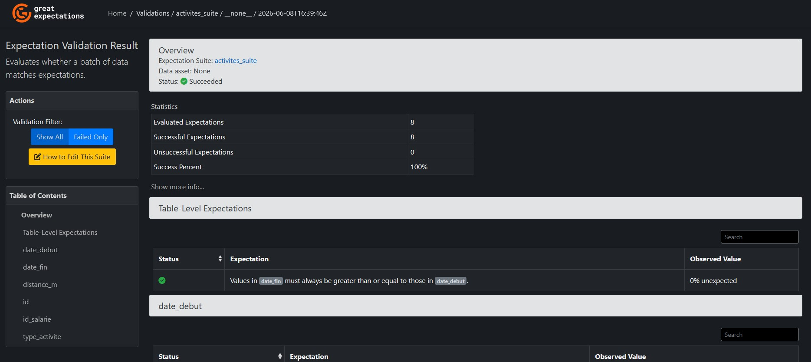
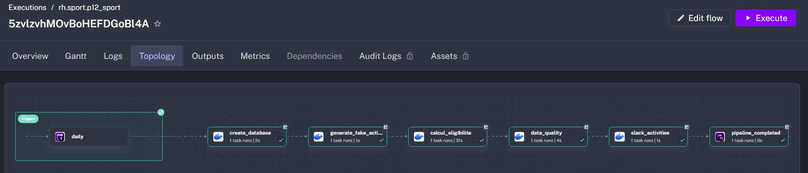
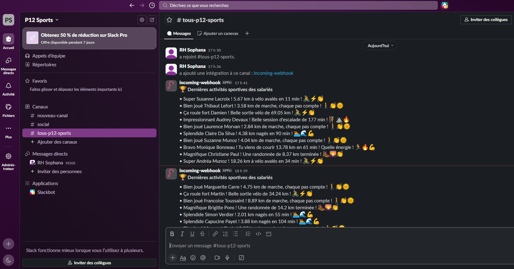
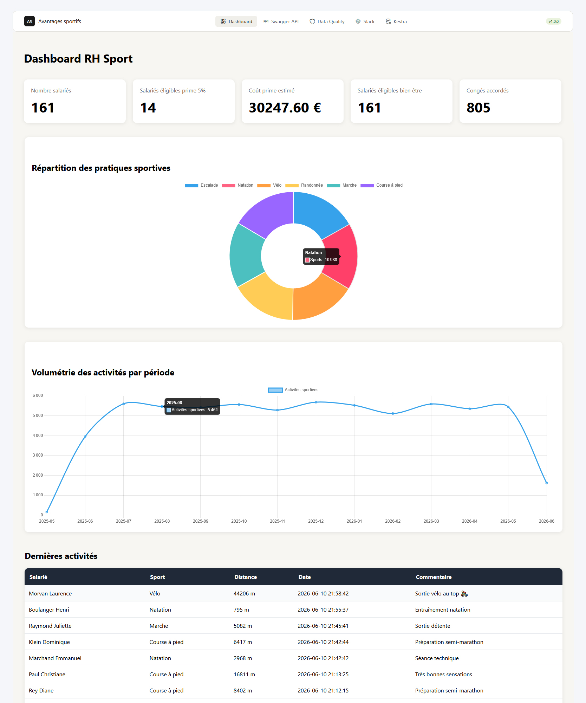

# POC Avantages Sportifs — Sport Data Solution

Pipeline Flask/SQLite de bout en bout pour gérer, valider et visualiser les avantages sportifs des salariés.

## 📂 Structure du projet



```bash
project/
│
├── app/
│   ├── services/
│   │   ├── google_maps_service.py        # Ajout de la distance domicile/travail en km
│   │   └── eligibilite_service.py        # Vérifie éligibilité des salariés
│   │
│   ├── repositories/
│   │   └── sqlite_repository.py
│   │
│   └── routes/                           # Routes pour API
│   │   ├── activites_routes.py
│   │   ├── dashboard_routes.py
│   │   ├── eligibilite_routes.py
│   │   ├── employes_routes.py
│   │   └── kpis_routes.py
│   │
│   └── static/                           # css, js, fonts
│   │   └── gx_docs/ 
│   │
│   └── templates/                        # Flask HTML
│   │
│   ├── config.py
│   └── main.py
│   
├── scripts/
│   ├── create_sqlite_db.py               # Création BDD sqlite + injection des données
│   ├── ge_validation.py                  # Qualité des données (Great Expectations)
│   ├── generate_fake_activities.py       # Génération de fausses activités
│   └── run_eligibilite.py
│
├── data/
│   └── avantages_sportifs.db
│
├── gx/                                   # Configuration Great Expectations
│
├── .env                                  # Fichier d'environnement    
└── requirements.txt                      # Dépendances python
```

---

## ⚙️ Installation

### 1. Créer un environnement virtuel

```bash
python -m venv venv
```

### 2. Activer l’environnement

```bash
# Si les scripts (.ps1) sont bloqués
Set-ExecutionPolicy -Scope Process -ExecutionPolicy Bypass

# Windows
.venv\Scripts\activate
```

### 3. Installer les dépendances

```bash
pip install -r requirements.txt
```

---

## 🔐 Configuration

Créer un fichier `.env` à la racine :

```env
FLASK_ENV=development
FLASK_DEBUG=1

# Google Maps API
GOOGLE_MAPS_API_KEY=your_api_key_here

# Paramètres métier (modifiables sans toucher au code)
PRIME_TAUX=0.05
BIEN_ETRE_SEUIL_ACTIVITES=15
BIEN_ETRE_JOURS=5
DISTANCE_MAX_MARCHE_KM=15
DISTANCE_MAX_VELO_KM=25

# Adresse entreprise
ADRESSE_ENTREPRISE=1362 Av. des Platanes, 34970 Lattes

# Slack URL du webhook
SLACK_WEBHOOK_URL="URL_du_webhook"
```


---

## 🚀 Initialisation du projet

### 1. Générer la base SQLite

Le script suivant :

* crée la base SQLite
* crée les tables RH
* injecte les données salariés
* génère les activités sportives simulées

```bash
python scripts/create_sqlite_db.py
```

---

### 2. Générer les données Strava simulées

Simulation cohérente de plusieurs milliers d’activités sportives sur les 12 derniers mois :

```bash
python scripts/generate_fake_activities.py
```

Les activités générées contiennent :

| Champ         | Description          |
| ------------- | -------------------- |
| id            | Identifiant activité |
| id_salarie    | Identifiant salarié  |
| date_debut    | Début activité       |
| date_fin      | Fin activité         |
| type_activite | Sport pratiqué       |
| distance_m    | Distance en mètres   |
| commentaire   | Commentaire libre    |

---

### 3. Calculer l’éligibilité des salariés

Ce script :

* vérifie les règles métier
* calcule les primes
* calcule les jours bien-être
* calcule les distances domicile/travail via Google Maps
* détecte les incohérences de déclaration

```bash
python scripts/run_eligibilite.py
```

---

## 🧪 Qualité des données

Le projet utilise :
Great Expectations

afin de contrôler automatiquement :

* unicité des identifiants
* distances positives
* dates valides
* types de sports autorisés
* cohérence des salariés
* présence des distances obligatoires

---

### Exécuter les contrôles qualité

```bash
python scripts/ge_validation.py
```

---

### Data Docs Great Expectations

Les rapports qualité HTML générés par :
Great Expectations

sont accessibles directement depuis Flask via le dossier :

```bash
app/static/gx_docs/
```

---

### Accès navigateur

```bash
http://127.0.0.1:5000/static/gx_docs/index.html
```

---

### Génération des rapports

```bash
python scripts/ge_validation.py
```

Les Data Docs sont ensuite copiés automatiquement dans :

```bash
app/static/gx_docs/
```

afin d’être servis directement par Flask.



---

## ⚙️ Orchestration avec Kestra

Le projet utilise Kestra afin d'automatiser l'exécution des différentes étapes du pipeline de données :

* création de la base SQLite
* génération des activités sportives simulées
* calcul de l'éligibilité des salariés
* exécution des contrôles Great Expectations
* génération des rapports qualité
* envoi de notifications Slack

### Accès Kestra

```bash
http://127.0.0.1:8080
```


---

## 🔔 Notifications Slack

Le projet intègre Slack afin de notifier automatiquement les utilisateurs à la fin des traitements.

Les notifications peuvent contenir :

* les 10 dernières activités sportives enregistrées
* les indicateurs clés du programme sportif
* les anomalies détectées par Great Expectations
* les erreurs d'exécution du pipeline

### Exemples de notifications

```text
🏆 Dernières activités sportives

• Bravo Sarah Martin ! Tu viens de courir 8.4 km en 42 min ! 🏃🔥💪
• Super Lucas Bernard ! 21.7 km à vélo avalés en 55 min ! 🚴⚡👏
• Bien joué Emma Leroy ! 4.2 km de marche, chaque pas compte ! 🚶👏🌞
```



---

## 🌍 Google Maps API

Le projet utilise :
Google
Distance Matrix API

pour calculer :

* distance domicile ↔ entreprise
* cohérence des modes de transport déclarés

---

### Règles métier

| Mode de déplacement | Distance maximale |
| ------------------- | ----------------- |
| Marche / Running    | 15 km             |
| Vélo / Trottinette  | 25 km             |

---

### Exemple d’anomalie détectée

```text
[WARNING] salarié 21886 :
distance incohérente (42 km en marche)
```

---

## 🖥️ Lancer Flask

### Démarrer le serveur

```bash
python -m app.main
```

---

### Accès application

| Fonctionnalité     | URL                               |
| ------------------ | --------------------------------- |
| Dashboard RH       | http://127.0.0.1:5000             |
| API Swagger        | http://127.0.0.1:5000/swagger     |
| Great Expectations | http://127.0.0.1:5000/gx_docs     |
| Slack              | https://app.slack.com/client      |
| Kestra             | http://127.0.0.1:8080             |
| KPIs               | http://127.0.0.1:5000/kpis        |
| Employés           | http://127.0.0.1:5000/employes    |
| Activités          | http://127.0.0.1:5000/activites   |
| Éligibilité        | http://127.0.0.1:5000/eligibilite |

---

## 📊 Dashboard RH

Le dashboard Flask permet de visualiser :

* nombre total de salariés
* pourcentage de sportifs
* coûts estimés des avantages
* nombre de jours bien-être attribués
* répartition des pratiques sportives
* activités sportives par mois
* anomalies détectées
* distances domicile/travail

Les graphiques sont réalisés avec :

Chart.js



---

## 🧠 Architecture du projet

Le projet suit une architecture inspirée :

* Clean Architecture
* séparation services / routes / repositories
* logique métier centralisée
* API REST Flask
* stockage SQLite

---

## 🐳 Déploiement avec Docker

### Prérequis

Installer :

```bash
# Démarrage de la plateforme avec reconstruction des images
docker compose up --build
```

Vérifier l'installation :

```bash
docker --version
docker compose version
```

### Services déployés

| Service | Description               | Port |
| ------- | ------------------------- | ---- |
| Flask   | Dashboard RH et API REST  | 5000 |
| Kestra  | Orchestrateur du pipeline | 8080 |

### Vérification des conteneurs

```bash
docker ps
```

Exemple :  

| CONTAINER ID | IMAGE                         | STATUS |
|-------------|-------------------------------|--------|
| xxxxxxxxxxxx | p12-sport-data-solution-flask | Up |
| xxxxxxxxxxxx | kestra/kestra                 | Up |


### Réinitialisation complète

⚠️ Supprime les conteneurs et volumes.


```bash
docker compose down -v
```

## 🛠️ Technologies utilisées

| Technologie        | Usage                    |
| ------------------ | ------------------------ |
| Python             | Backend                  |
| Flask              | API & Dashboard          |
| SQLite             | Base de données          |
| Great Expectations | Qualité des données      |
| Kestra             | Orchestration pipeline   |
| Slack              | Notifications / alertes  |
| Chart.js           | Visualisation            |
| Google Maps API    | Calcul des distances     |
| Pandas             | Manipulation des données |

---

## 👨‍💻 Auteur

Projet réalisé dans le cadre d’un POC Data Engineering / Data Quality / Flask.
